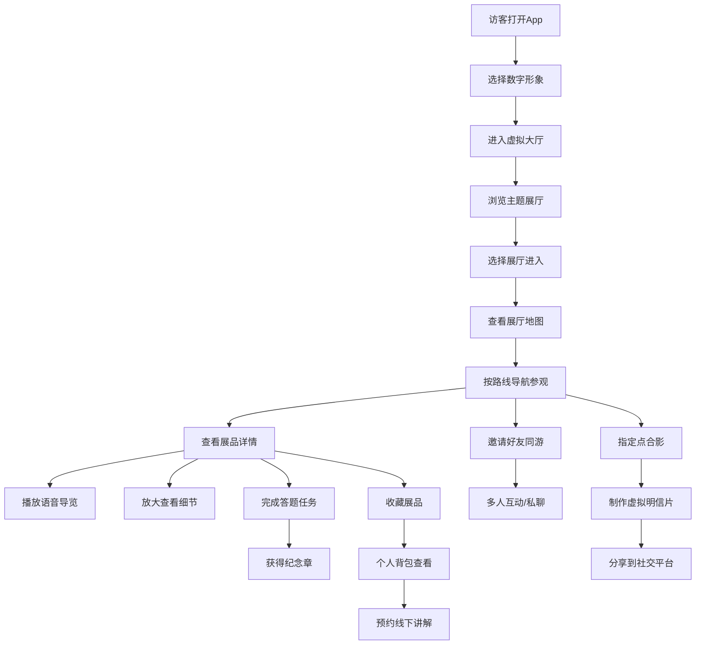

## 1. 产品概述

元宇宙博物馆虚拟参观平台是一款面向博物馆和城市展馆访客的沉浸式移动应用，通过数字化技术将实体展馆搬到虚拟空间，让用户足不出户即可享受高质量的文化艺术体验。

- **核心目标**：打破时空限制，为访客提供沉浸式、互动性强的虚拟参观体验
- **目标用户**：博物馆爱好者、学生群体、家庭游客、行动不便人士、远程参观者
- **市场价值**：赋能文化场馆数字化转型，提升文化传播力，创造全新的文旅体验模式

## 2. 核心功能

### 2.1 用户角色
| 角色 | 注册方式 | 核心权限 |
|------|----------|----------|
| 普通访客 | 手机号/微信登录 | 虚拟参观、导览任务、多人同行、拍照分享 |
| VIP访客 | 付费升级 | 独家展厅、专属导览、限定纪念章、高清细节 |

### 2.2 功能模块
1. **虚拟大厅**：数字形象选择、主题展厅入口、活动公告、好友列表
2. **展厅地图**：全局地图导航、展厅分布、路线规划、当前定位
3. **展品详情**：展品介绍、语音导览、细节放大、3D 旋转、收藏功能
4. **导览任务**：答题闯关、任务进度、纪念章收集、成就系统
5. **多人同行**：好友邀请、实时语音、表情动作、私聊互动
6. **拍照分享**：虚拟合影、明信片制作、社交分享、保存相册
7. **个人背包**：收藏展品、纪念章展示、参观记录、预约管理、设置中心

### 2.3 页面详情
| 页面名称 | 模块名称 | 功能描述 |
|---------|---------|----------|
| 虚拟大厅 | 数字形象 | 选择/切换数字人形象，自定义外观 |
| 虚拟大厅 | 展厅入口 | 主题展厅卡片展示，一键进入 |
| 虚拟大厅 | 活动公告 | 最新展览、限时活动轮播展示 |
| 虚拟大厅 | 在线好友 | 好友在线状态，快速邀请同游 |
| 展厅地图 | 全局地图 | 展馆俯视图，展厅位置标注 |
| 展厅地图 | 路线导航 | 最优路径规划，导航指引 |
| 展厅地图 | 展厅列表 | 按主题分类的展厅清单 |
| 展厅地图 | 当前定位 | 实时显示当前所在位置 |
| 展品详情 | 展品信息 | 名称、年代、材质、尺寸、介绍 |
| 展品详情 | 语音导览 | 专业讲解音频，播放控制 |
| 展品详情 | 细节查看 | 双指缩放，局部高清放大 |
| 展品详情 | 无障碍字幕 | 字幕开关，字号调节 |
| 展品详情 | 收藏功能 | 一键收藏，加入个人背包 |
| 导览任务 | 任务列表 | 主线任务、支线任务、每日任务 |
| 导览任务 | 答题闯关 | 展品相关知识问答 |
| 导览任务 | 纪念章 | 完成任务获得纪念章，收集册展示 |
| 导览任务 | 进度追踪 | 任务完成度，成就徽章 |
| 多人同行 | 好友列表 | 在线好友，邀请同游 |
| 多人同行 | 实时互动 | 表情动作，位置同步 |
| 多人同行 | 私聊功能 | 一对一文字/语音聊天 |
| 多人同行 | 合影打卡 | 指定点位虚拟合影 |
| 拍照分享 | 虚拟相机 | 场景拍照，滤镜特效 |
| 拍照分享 | 明信片 | 模板选择，文字编辑 |
| 拍照分享 | 社交分享 | 分享到微信、微博等平台 |
| 拍照分享 | 我的相册 | 历史照片管理 |
| 个人背包 | 我的收藏 | 收藏的展品列表 |
| 个人背包 | 纪念章册 | 已收集的纪念章展示 |
| 个人背包 | 参观记录 | 参观时长、足迹统计 |
| 个人背包 | 预约管理 | 线下讲解预约 |
| 个人背包 | 问题反馈 | 展陈问题提交 |
| 个人背包 | 设置中心 | 音效、字幕、隐私等设置 |

## 3. 核心流程

## 4. 用户界面设计

### 4.1 设计风格
- **主色调**：深空蓝 (#0A1628) 作为背景主色，营造沉浸式虚拟空间感
- **点缀色**：霓虹金 (#D4AF37) 作为重点强调色，体现博物馆的尊贵与文化底蕴
- **辅助色**：青碧色 (#00D4AA) 用于交互元素和状态提示
- **中性色**：银灰色系 (#8892A6, #C8D0E0) 用于文字和边框
- **按钮风格**：圆角胶囊形按钮，带有微弱发光效果，悬停时有呼吸动画
- **字体**：标题使用衬线体体现文化感，正文使用无衬线体保证可读性
- **布局风格**：卡片式布局，玻璃拟态效果，层次感丰富
- **图标风格**：线性图标，金色描边，选中态填充发光
- **整体调性**：科技感与文化感融合，沉浸式、精致、未来感

### 4.2 页面设计概览
| 页面名称 | 模块名称 | UI 元素 |
|---------|---------|---------|
| 虚拟大厅 | 主视觉 | 3D 大厅背景，数字人展示，悬浮展厅入口卡片 |
| 虚拟大厅 | 顶部栏 | 返回、消息通知、设置入口 |
| 虚拟大厅 | 底部 | 底部导航栏（5个Tab） |
| 展厅地图 | 地图区域 | 俯视平面图，房间高亮，路径动画 |
| 展厅地图 | 侧边栏 | 展厅列表，筛选分类 |
| 展厅地图 | 底部 | 导航控制面板，当前位置信息 |
| 展品详情 | 展品展示 | 大图/3D 模型，缩放手势，旋转控制 |
| 展品详情 | 信息区 | 展品介绍，标签，收藏按钮 |
| 展品详情 | 播放器 | 语音导览播放条，进度条，字幕开关 |
| 导览任务 | 任务列表 | 任务卡片，进度条，奖励图标 |
| 导览任务 | 答题区 | 题目卡片，选项按钮，倒计时 |
| 导览任务 | 纪念章 | 纪念章网格，收集进度，发光效果 |
| 多人同行 | 好友列表 | 头像，在线状态，邀请按钮 |
| 多人同行 | 互动区 | 表情动作栏，私聊入口，合影按钮 |
| 拍照分享 | 相机界面 | 取景框，滤镜选择，快门按钮 |
| 拍照分享 | 编辑区 | 明信片模板，文字输入，装饰贴纸 |
| 个人背包 | 顶部 | 头像，昵称，参观数据统计 |
| 个人背包 | 功能入口 | 收藏、纪念章、记录、预约、反馈、设置 |
| 个人背包 | 列表区 | 各分类内容列表，卡片式展示 |

### 4.3 响应式
- **移动端优先**：采用移动优先设计，针对手机屏幕优化
- **触摸优化**：大尺寸点击区域，手势操作支持（滑动、双指缩放）
- **安全区适配**：适配刘海屏、全面屏等不同机型
- **横竖屏**：主要支持竖屏，部分场景（如展品详情）支持横屏全屏查看

### 4.4 虚拟场景视觉指引
- **环境氛围**：深蓝色星空背景配合微弱粒子效果，营造元宇宙空间感
- **光照设置**：柔和的环境光 + 重点展品的聚光灯效果
- **动效设计**：页面转场采用淡入淡出 + 轻微缩放，按钮悬停有呼吸发光效果
- **景深效果**：前景、中景、背景分层，营造空间纵深感
- **粒子效果**：大厅有悬浮光点，展厅有微尘浮动效果
