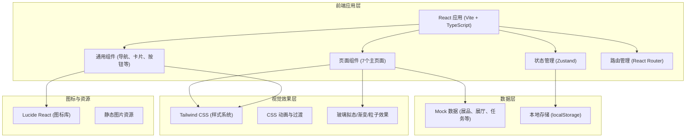

## 1. 架构设计



## 2. 技术选型说明

- **前端框架**：React 18 + TypeScript + Vite
  - 选择 React 生态，组件化开发，丰富的社区资源
  - TypeScript 提供类型安全，降低维护成本
  - Vite 提供极速的开发体验和构建性能
  
- **样式方案**：Tailwind CSS 3
  - 原子化 CSS，快速构建 UI
  - 自定义主题配置，统一设计语言
  - 响应式设计内置支持

- **状态管理**：Zustand
  - 轻量级状态管理，简单易用
  - 支持持久化存储
  - 适合中小规模应用

- **路由管理**：React Router v6
  - 声明式路由，嵌套路由支持
  - 移动端页面切换动画

- **图标库**：Lucide React
  - 一致性高的线性图标
  - 支持自定义大小和颜色

- **数据方案**：Mock 数据 + localStorage
  - 纯前端演示，使用 Mock 数据模拟后端
  - localStorage 存储用户数据（收藏、纪念章、设置等）

## 3. 路由定义

| 路由路径 | 页面名称 | 说明 |
|---------|---------|------|
| / | 虚拟大厅 | 应用首页，数字形象和展厅入口 |
| /map | 展厅地图 | 全局地图导航和展厅列表 |
| /exhibit/:id | 展品详情 | 展品介绍、语音导览、细节查看 |
| /tasks | 导览任务 | 任务列表、答题闯关、纪念章 |
| /social | 多人同行 | 好友列表、互动、私聊 |
| /camera | 拍照分享 | 虚拟相机、明信片、分享 |
| /backpack | 个人背包 | 收藏、纪念章、记录、设置 |

## 4. 项目结构

```
src/
├── components/          # 通用组件
│   ├── BottomNav.tsx    # 底部导航栏
│   ├── ExhibitCard.tsx  # 展品卡片
│   ├── HallCard.tsx     # 展厅卡片
│   ├── Badge.tsx        # 纪念章组件
│   ├── Avatar.tsx       # 头像组件
│   ├── AudioPlayer.tsx  # 语音播放器
│   ├── GlassCard.tsx    # 玻璃拟态卡片
│   └── ProgressBar.tsx  # 进度条组件
├── pages/               # 页面组件
│   ├── Lobby.tsx        # 虚拟大厅
│   ├── HallMap.tsx      # 展厅地图
│   ├── ExhibitDetail.tsx # 展品详情
│   ├── GuideTasks.tsx   # 导览任务
│   ├── Multiplayer.tsx  # 多人同行
│   ├── PhotoShare.tsx   # 拍照分享
│   └── Backpack.tsx     # 个人背包
├── store/               # 状态管理
│   └── useAppStore.ts   # 全局状态
├── data/                # Mock 数据
│   ├── exhibits.ts      # 展品数据
│   ├── halls.ts         # 展厅数据
│   ├── tasks.ts         # 任务数据
│   ├── badges.ts        # 纪念章数据
│   └── friends.ts       # 好友数据
├── types/               # TypeScript 类型定义
│   └── index.ts         # 类型定义文件
├── utils/               # 工具函数
│   ├── storage.ts       # 本地存储工具
│   └── helpers.ts       # 通用工具函数
├── App.tsx              # 应用入口组件
├── main.tsx             # 应用入口
└── index.css            # 全局样式
```

## 5. 数据模型

### 5.1 核心数据类型

```typescript
// 展品
interface Exhibit {
  id: string;
  name: string;
  image: string;
  description: string;
  era: string;
  material: string;
  size: string;
  hallId: string;
  audioUrl: string;
  audioDuration: number;
  subtitle: string;
  isCollected: boolean;
}

// 展厅
interface Hall {
  id: string;
  name: string;
  theme: string;
  description: string;
  coverImage: string;
  exhibitCount: number;
  position: { x: number; y: number };
  isNew: boolean;
}

// 任务
interface Task {
  id: string;
  title: string;
  description: string;
  type: 'main' | 'side' | 'daily';
  exhibitId?: string;
  question?: string;
  options?: string[];
  correctAnswer?: number;
  reward: string;
  badgeId?: string;
  progress: number;
  isCompleted: boolean;
}

// 纪念章
interface Badge {
  id: string;
  name: string;
  image: string;
  description: string;
  rarity: 'common' | 'rare' | 'epic' | 'legendary';
  isUnlocked: boolean;
  unlockedAt?: number;
}

// 好友
interface Friend {
  id: string;
  name: string;
  avatar: string;
  isOnline: boolean;
  currentHall?: string;
}

// 用户数据
interface UserData {
  avatar: string;
  nickname: string;
  collectedExhibits: string[];
  unlockedBadges: string[];
  completedTasks: string[];
  visitDuration: number;
  reservations: Reservation[];
  settings: UserSettings;
}

// 预约
interface Reservation {
  id: string;
  type: 'offline_guide';
  date: string;
  time: string;
  status: 'pending' | 'confirmed' | 'completed' | 'cancelled';
}

// 用户设置
interface UserSettings {
  soundEnabled: boolean;
  subtitleEnabled: boolean;
  subtitleSize: 'small' | 'medium' | 'large';
  autoplayAudio: boolean;
}
```

### 5.2 状态管理设计

```typescript
// 全局 Store
interface AppState {
  // 用户
  user: UserData;
  
  // 导航
  currentPage: string;
  currentHallId: string | null;
  currentExhibitId: string | null;
  
  // 播放
  isPlaying: boolean;
  currentAudioId: string | null;
  playbackProgress: number;
  
  // Actions
  setCurrentPage: (page: string) => void;
  toggleCollect: (exhibitId: string) => void;
  completeTask: (taskId: string) => void;
  unlockBadge: (badgeId: string) => void;
  updateSettings: (settings: Partial<UserSettings>) => void;
  addVisitDuration: (seconds: number) => void;
}
```

## 6. 组件规范

### 6.1 组件设计原则
- 单一职责：每个组件专注一个功能
- 可复用性：通用组件抽象出来，避免重复代码
- 可组合性：通过组件组合构建复杂页面
- Props 声明：使用 TypeScript 接口明确 props 类型

### 6.2 命名规范
- 组件文件：PascalCase，如 `ExhibitCard.tsx`
- 组件名：PascalCase，如 `ExhibitCard`
- 函数/变量：camelCase
- 类型/接口：PascalCase

## 7. 样式系统

### 7.1 颜色变量
```css
:root {
  --bg-primary: #0A1628;
  --bg-secondary: #112240;
  --bg-card: rgba(255, 255, 255, 0.05);
  --accent-gold: #D4AF37;
  --accent-teal: #00D4AA;
  --text-primary: #F0F4FA;
  --text-secondary: #8892A6;
  --text-muted: #5A6478;
  --border-glass: rgba(255, 255, 255, 0.1);
}
```

### 7.2 动效规范
- 过渡时长：快速 150ms，常规 300ms，慢速 500ms
- 缓动函数：ease-out 用于进场，ease-in 用于退场
- 动画类型：opacity、transform、box-shadow

## 8. 性能优化

- 组件懒加载：非首屏页面使用 React.lazy
- 图片优化：使用适当格式，支持响应式图片
- 状态合理划分：避免不必要的重渲染
- 列表虚拟化：长列表使用虚拟滚动
- CSS 优化：使用 Tailwind 的 JIT 模式，减少 CSS 体积
